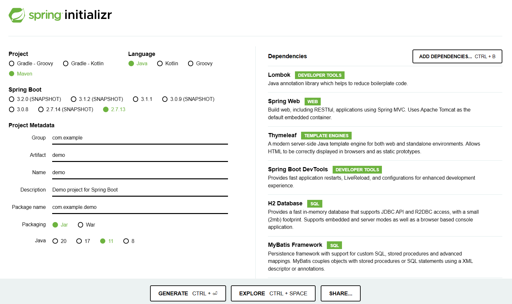

# spring-boot2-try

## やりたいこと

* Spring-Bootを使った効率的な開発をする、起動までに必要な手順を最小化する
* javaとMySQLだけがインストールされたマシンで、アプリケーションを起動する
* 起動時に自動でテーブルをcreateし、dataをインサートしてから、アプリケーションが起動する
* setter,getterは作成しない。lombokが生成してくれる
* 二重サブミット対策としてPRGパターンを使う
* Mavenを使ったライブラリ管理（自動でjarをダウンロードして、クラスパスを通してくれる）

さいきょうの二重サブミット対策  
https://qiita.com/syobochim/items/120109315f671918f28d  

【Java】Lombokで冗長コードを削減しよう  
https://www.casleyconsulting.co.jp/blog/engineer/107/ 

## 前提環境

以下がインストール済みであること
* JDK 11
* MySQL 8
* git

## 使用するフレームワーク

* spring-boot2.7
* spring-boot-starter-web
* thymeleaf
* mybatis
* lombok
* 組み込みTomcat 9
* 組み込みMaven 3

## ディレクトリ階層

今回、起動するアプリケーションのディレクトリ階層
```
C:.
│  .gitignore
│  initializr.png
│  mvnw
│  mvnw.cmd
│  pom.xml
│  README.md
├─src
│  ├─main
│  │  ├─java
│  │  │  └─com
│  │  │      └─example
│  │  │          └─demo
│  │  │              │  DemoApplication.java
│  │  │              │  
│  │  │              ├─entity
│  │  │              │      Item.java
│  │  │              │      ItemMapper.java
│  │  │              │      
│  │  │              ├─regist
│  │  │              │      ItemForm.java
│  │  │              │      ItemRegistService.java
│  │  │              │      RegistController.java
│  │  │              │      
│  │  │              └─top
│  │  │                      ItemFindService.java
│  │  │                      TopController.java
│  │  │                      
│  │  └─resources
│  │      │  application.properties
│  │      │  data-all.sql
│  │      │  schema-all.sql
│  │      │  
│  │      ├─static
│  │      └─templates
│  │          ├─regist
│  │          │      complete.html
│  │          │      confirm.html
│  │          │      regist.html
│  │          │      
│  │          └─top
│  │                  index.html
```

## アプリケーションの構造


* Formクラスは画面層で使用するクラス
* データベース層ではFormクラスは使用しない。しっかりレイヤーを分ける。
* Entityクラスはデータベース層で使用するクラス
* 画面層ではEntityクラスは使用しないが、表示用には使用しても良い。Formという役割でEntityを使うことはダメ。
* コントローラ⇒サービス⇒マッパーの順番で実装する。
* コントローラ⇒マッパーの順番では実装しない。しっかりレイヤーを分ける。

## 準備1 mysqlのデータベース作成

データベースのみ作成する。テーブルは作成しない。
```
コマンドプロンプトで実行
mysql -u root -p

create database mydb;

exit
```

## 準備2 githubからソースコードを取得

ソースコードをダウンロードする
```
コマンドプロンプトで実行
git clone https://github.com/namickey/spring-boot2-try.git
cd spring-boot2-try
```

## 実行 spring-boot:run

起動する
```
コマンドプロンプトで実行
mvnw.cmd spring-boot:run

「mvn」や「mvnw.cmd」はmavenのコマンドで、pom.xmlに記載されたライブラリ管理（自動的にクラスパス追加）
初回はライブラリのダウンロードに多少時間がかかった後に、起動する
```

## ブラウザアクセス
http://localhost:8080/

* TOP画面でitem一覧を表示する  
* 登録画面でitemを登録する  

## 停止
```
コマンドプロンプトで実行
Ctrl + C
```

## 開発する

統合開発環境（vscode、eclipse、intelliJ）を使って機能追加しよう
* 入力チェックの追加
* エラーハンドリングの追加
* 検索画面の追加
* 削除画面の追加
* スタイルシートの追加
* javascriptの追加
* etc

## 公開する

* 自分のgithubアカウントを作って、ソースを公開しよう

## 参考　spring initializr

spring-bootの最小構成のデモアプリケーションを作成して、ダウンロードする  

https://start.spring.io/

https://spring.pleiades.io/quickstart

今回使用したライブラリの設定イメージ  


## 参考

以下が網羅的かつ実務的かつ実用的なspring-boot開発

Spring Frameworkを利用する実プロジェクトで活用できる設計・開発標準  
https://fintan.jp/page/5311/
